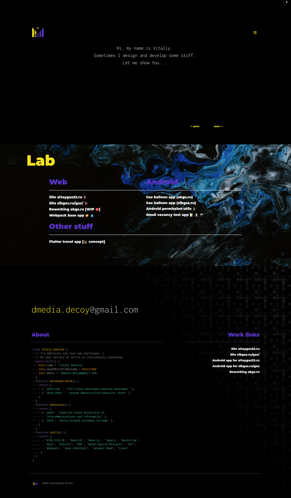
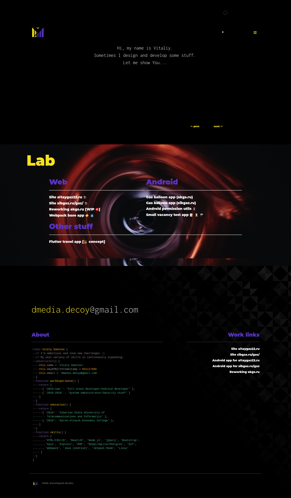
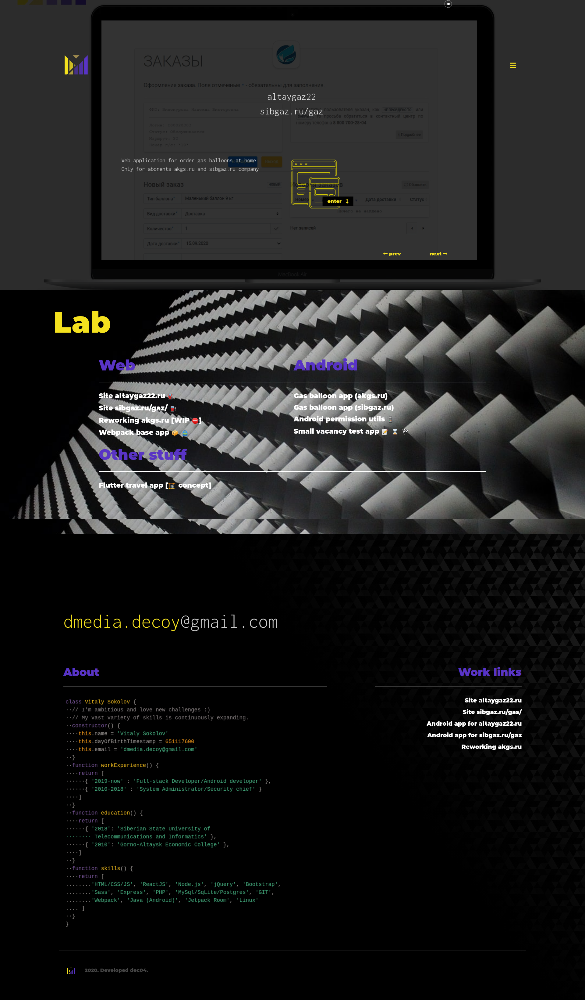
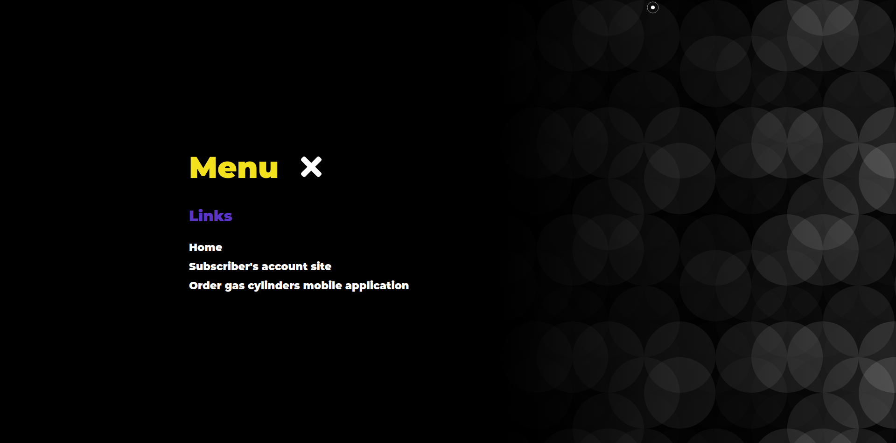
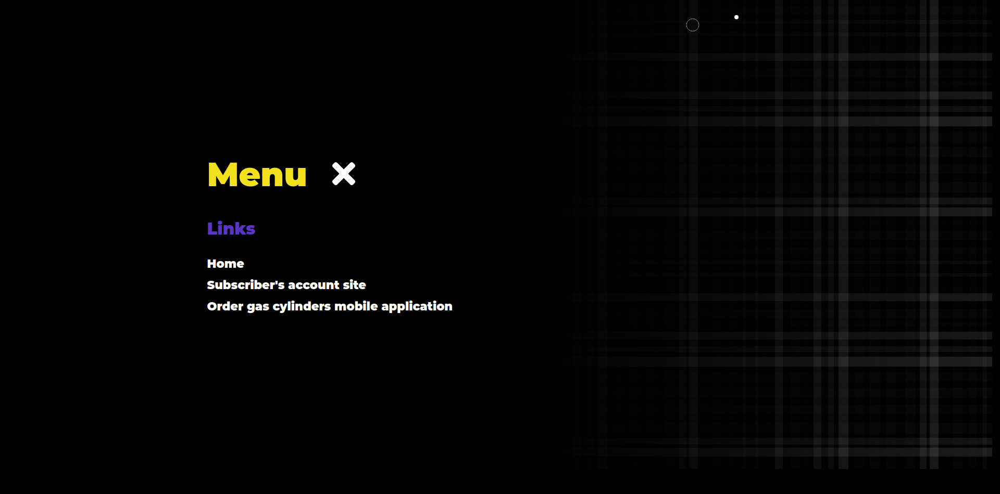

# Dec04 portfolio website
## Available on [herokuapp.com](https://dec04-pf.herokuapp.com/)

This is personal portfolio by dec04. 
You will free to use this code by open source projects.

## :zap: Recent Activity

<!--START_SECTION:activity-->
1. 🎉 Merged PR [#2](https://github.com/dec04/my-portfolio/pull/2) in [dec04/my-portfolio](https://github.com/dec04/my-portfolio)
2. 💪 Opened PR [#2](https://github.com/dec04/my-portfolio/pull/2) in [dec04/my-portfolio](https://github.com/dec04/my-portfolio)
3. 🎉 Merged PR [#1](https://github.com/dec04/my-portfolio/pull/1) in [dec04/my-portfolio](https://github.com/dec04/my-portfolio)
4. 💪 Opened PR [#1](https://github.com/dec04/my-portfolio/pull/1) in [dec04/my-portfolio](https://github.com/dec04/my-portfolio)
5. 🎉 Merged PR [#2](https://github.com/dec04/dec04/pull/2) in [dec04/dec04](https://github.com/dec04/dec04)
<!--END_SECTION:activity-->

#### Technology stack:

  - [ReactJS](https://reactjs.org/)
  - [Bootstrap 4](https://getbootstrap.com/)
  - [Webpack JS](https://webpack.js.org/)
  - [Express JS](https://expressjs.com/)
  - [Node JS](https://nodejs.org/)

#### Features:

 1. images on Lab section dynamicaly downloads from unsplash by API.
 2. Random background pattern generator
 3. Dynamicaly changed background on main section when switching project

Happy hacking. :heart_decoration:

